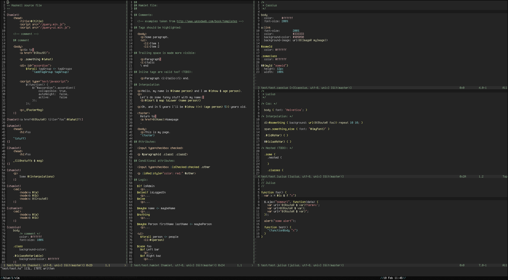

# Shakespeare Syntax

A collection of vim syntax files for working in the [shakespeare][]
templating languages used by Yesod.

[shakespeare]: http://hackage.haskell.org/package/shakespeare

Provided is each `syntax/$language.vim` file for external templates as
well as an `after/syntax/haskell.vim` which will properly highlight
quasi-quoted blocks inside a haskell source file.

## Installation

- Use [Vundle][]
- Add `Plugin 'pbrisbin/vim-syntax-shakespeare'`

[vundle]: https://github.com/gmarik/Vundle.vim

## Options

The following options can be added to your `~/.vimrc` in order to
to change the behaviour of this plugin.

Allow one-liner QQs even if they have invalid nesting:

```vim
let g:hamlet_prevent_invalid_nesting = 0
```

Don't highlight empty space at the end of lines:

```vim
let g:hamlet_highlight_trailing_space = 0
```

### Todo

* javascript inside a script tag is difficult due to the lack of a
  \</script> region-end

* highlight in-line html tags added as raw

* nested blocks in lucius

* bug in lucius unquoted interpolations

### Screenshots

Embedded hamlet in a haskell source file:


